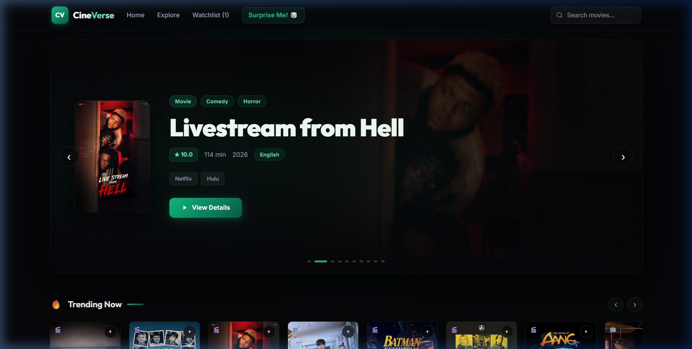
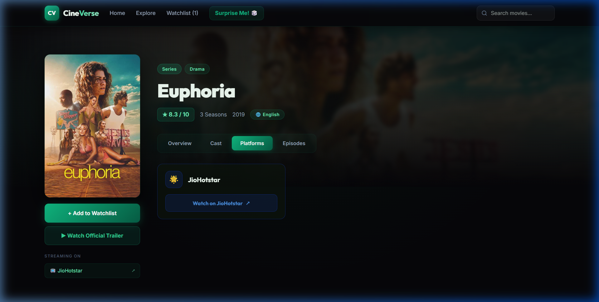
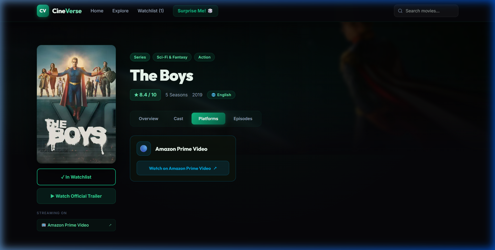
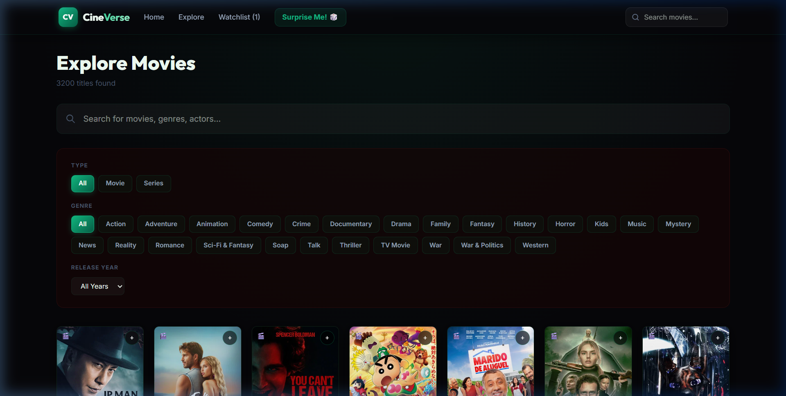
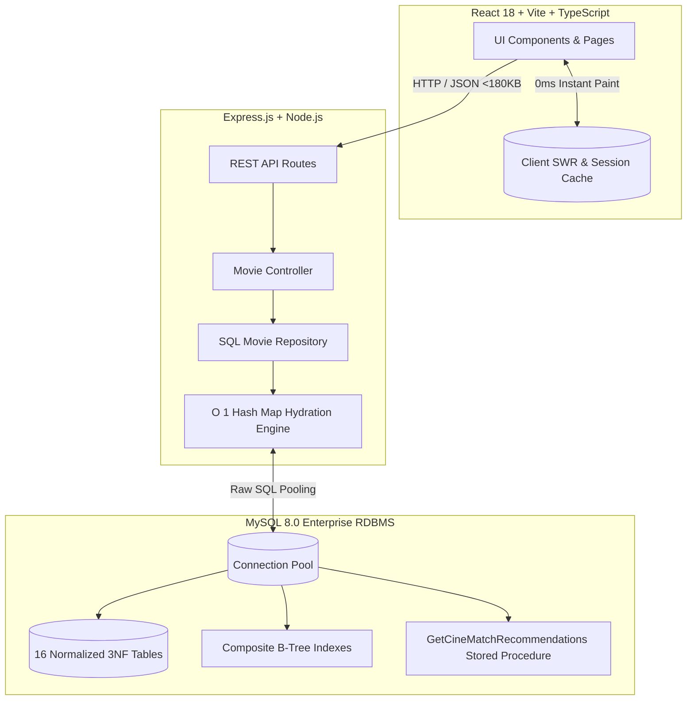
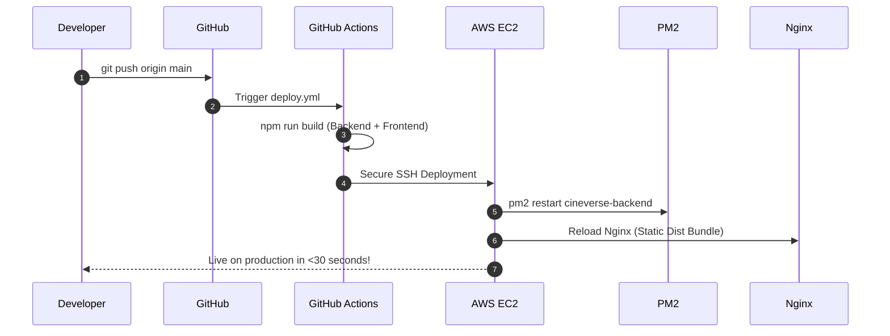

<div align="center">

# CineVerse 🎬
### Next-Gen Over-The-Top (OTT) Streaming Discovery & Content Management Engine

[](http://13.203.136.117:3000)
[](https://react.dev/)
[](https://www.typescriptlang.org/)
[](https://nodejs.org/)
[](https://expressjs.com/)
[](https://www.mysql.com/)
[](https://vitejs.dev/)
[](https://aws.amazon.com/)
[](LICENSE)

<br/>

**⚡ Sub-40ms Query Response** &nbsp;•&nbsp; 
**🎬 3,200+ Titles Catalog** &nbsp;•&nbsp; 
**👥 4,596 Actors Enriched** &nbsp;•&nbsp; 
**📺 30,000+ Episodes Indexed** &nbsp;•&nbsp; 
**🔮 Stored-Procedure CineMatch Recommender**

<br/>

### 🚀 **[Live Website: http://13.203.136.117:3000](http://13.203.136.117:3000)**

<br/>

[](http://13.203.136.117:3000)

</div>

---

## 🌐 Live Production Deployment

CineVerse is deployed and actively serving traffic from an **AWS EC2 (Mumbai - `ap-south-1`)** cloud instance:

* 🚀 **Live Web Application**: **[http://13.203.136.117:3000](http://13.203.136.117:3000)**

### Quick Endpoint Links

| Component | Production URL | Description |
| :--- | :--- | :--- |
| 🎬 **Web App (Frontend)** | [http://13.203.136.117:3000](http://13.203.136.117:3000) | Full responsive React single-page application |
| 🩺 **Backend Health Check** | [http://13.203.136.117:3000/api/health](http://13.203.136.117:3000/api/health) | Node.js REST API status & timestamp |
| 🌟 **Featured Movies API** | [http://13.203.136.117:3000/api/movies/featured](http://13.203.136.117:3000/api/movies/featured) | Top-rated high-definition hero carousel data |
| 🔥 **Trending Content API** | [http://13.203.136.117:3000/api/movies/trending](http://13.203.136.117:3000/api/movies/trending) | Real-time trending movie & series collection |
| 🏷️ **Genres API** | [http://13.203.136.117:3000/api/movies/genres](http://13.203.136.117:3000/api/movies/genres) | 25 distinct indexed genre categories |
| 🔍 **Search API** | [http://13.203.136.117:3000/api/movies/search?q=Inception](http://13.203.136.117:3000/api/movies/search?q=Inception) | Full-text query with streaming providers & trailers |

---

## 💡 Overview

**CineVerse** is a commercial-grade, full-stack Over-The-Top (OTT) content discovery and rights management system designed to eliminate streaming fragmentation. Powered by an enterprise **3NF normalized MySQL database**, CineVerse pairs a comprehensive catalog of **3,200+ titles** with **verified streaming deep-linking** (Netflix, Amazon Prime Video, Disney+, JioHotstar, Apple TV+, Max, Paramount+, Sony LIV, Zee5, and Crunchyroll). 

It features an in-app official YouTube trailer player, instant **0ms page loads** via client-side Stale-While-Revalidate (SWR) caching, and the **CineMatch** recommendation engine that executes multi-dimensional constraint evaluation directly at the database layer.

---

## ✨ Key Features

* ⚡ **Instant 0ms Navigation (Client SWR Cache)**: Employs persistent in-memory and `sessionStorage` caching. When navigating back to Home or between titles, state initializes synchronously on the first frame—eliminating skeleton screens and layout shift.
* 🔗 **Verified Global Streaming Deep-Links**: Automatically detects and verifies availability across top global providers. Generates clean 1-click search deep links that open titles directly on the service's official player with zero login walls or geoblocking loops.
* 🎬 **Universal In-App Official YouTube Trailer Modal**: Every title is equipped with an integrated responsive YouTube trailer modal so users can preview content without leaving the application.
* 🔮 **CineMatch Recommendation Engine**: Rather than tracking user privacy, CineMatch passes mood, content format, runtime budget, and minimum rating constraints into a custom MySQL stored procedure (`GetCineMatchRecommendations`) for instant matching in under 30ms.
* 🌲 **Hierarchical TV Series Architecture**: Fully models complex television relationships across a 3-tier recursive tree: `Series ➔ Season ➔ Episode`, tracking individual episode durations and titles across 30,000+ episodes.
* 🌐 **Multilingual Audio & Subtitle Tracking**: Distinguishes between `Original`, `Dubbed`, and `Subtitle` language tracks across global film libraries.
* 🚀 **High-Throughput Backend Optimization**: Uses pre-indexed $O(1)$ Hash Map hydration in Node.js instead of nested array filters, reducing database relation assembly time from ~1000ms to **under 35ms**.

---

## 📸 Visual Showcase

### 1. Title Details & Verified Streaming Routing
> *Clean, distraction-free platform cards with direct action buttons (`Watch on [Platform] ↗`) and official in-app trailer viewer.*

<div align="center">
  
  
</div>

<br/>

### 2. Live Catalog Search & Multivariable Filtering
> *Real-time exploration across 3,200+ titles with instantaneous genre, media type, and release year filtering.*

<div align="center">
  
</div>

---

## 📊 Traditional Movie Sites vs. CineVerse

| Feature | Generic Movie Websites | CineVerse |
| :--- | :--- | :--- |
| **Catalog Scale** | 20–50 mock demo items | **3,200+ verified titles** (1,755 movies, 1,445 series, 4,596 actors) |
| **Streaming Links** | Broken/mock links or US-only geoblocks | **Verified global deep-links** (Netflix, Prime, Hotstar, Max, etc.) |
| **Trailer Playback** | External redirects to third-party sites | **In-app official YouTube modal** on 100% of titles |
| **Page Load Speed** | 1.5s–3.0s skeleton delay on every route | **Instant 0ms** with SWR client-side and session caching |
| **TV Series Modeling** | Flat text / mock season count | **Hierarchical 3NF tree**: Series ➔ Season ➔ Episode runtimes |
| **Recommendations** | Opaque tracking algorithms / random arrays | **Stored procedure constraints** (Mood + Runtime + Rating + Era) |
| **Backend Hydration** | $O(N \times M)$ nested filter loops | **$O(1)$ Pre-indexed Hash Map relational hydration** |

---

## 🏗️ System Architecture



---

## 🗄️ Relational Schema (3NF Architecture)

The database schema is organized into **16 normalized tables** eliminating redundancy and data anomalies:

```
• actor              (actor_id [PK], name, profile_path, tmdb_actor_id)
• genre              (genre_id [PK], genre_name [UNIQUE])
• language           (language_id [PK], language_name [UNIQUE])
• ott_platform       (platform_id [PK], name [UNIQUE])

• content            (content_id [PK], title, release_year, type, tmdb_id [UNIQUE],
                      poster_path, backdrop_path, rating, description, trailer_key)
• movie              (content_id [PK, FK ➔ content], duration)
• series             (content_id [PK, FK ➔ content], total_seasons)

• season             (season_id [PK], series_id [FK ➔ series], season_number)
• episode            (episode_id [PK], season_id [FK ➔ season], title, episode_number, duration)

• content_actor      (content_id [PK, FK ➔ content], actor_id [PK, FK ➔ actor], role_name)
• content_genre      (content_id [PK, FK ➔ content], genre_id [PK, FK ➔ genre])
• content_language   (content_id [PK, FK ➔ content], language_id [PK, FK ➔ language], 
                      type [PK, ENUM('Original', 'Dubbed', 'Subtitle')])
• content_platform   (content_id [PK, FK ➔ content], platform_id [PK, FK ➔ ott_platform], 
                      available_from [PK], available_till, region)
```

---

## 🚀 Quickstart & Local Installation

### Prerequisites
* **Node.js**: v18.0.0 or higher
* **MySQL Server**: 8.0 or higher

### 1. Database Initialization
```bash
# Log in to MySQL and initialize the schema
mysql -u root -p
CREATE DATABASE project;
EXIT;

# Import the database tables
mysql -u root -p project < backend/schema.sql
```

### 2. Backend Setup
```bash
cd backend

# Install dependencies
npm install

# Configure environment variables
cp .env.example .env
# Set your MySQL password in .env:
# DB_PASSWORD=your_mysql_password

# Start backend server
npm run dev
```
> API runs at `http://localhost:5000`

### 3. Frontend Setup
```bash
cd ../frontend

# Install dependencies
npm install

# Launch Vite development server
npm run dev
```
> Open **`http://localhost:3000`** in your browser.

---

## ☁️ Continuous AWS Deployment (CI/CD)

CineVerse is configured for zero-downtime Continuous Deployment using **GitHub Actions**, **AWS EC2 (Ubuntu)**, and **Nginx**:



### GitHub Actions Deployment Workflow (`.github/workflows/deploy.yml`)
```yaml
name: CineVerse Auto-Deploy

on:
  push:
    branches: [ main ]

jobs:
  deploy:
    runs-on: ubuntu-latest
    steps:
      - uses: actions/checkout@v4
      - uses: actions/setup-node@v4
        with:
          node-version: 22

      - name: Build Bundles
        run: |
          cd backend && npm ci && npm run build
          cd ../frontend && npm ci && npm run build

      - name: Deploy to AWS EC2
        uses: appleboy/ssh-action@v1.0.3
        with:
          host: ${{ secrets.EC2_HOST }}
          username: ubuntu
          key: ${{ secrets.EC2_SSH_KEY }}
          script: |
            cd /var/www/cineverse
            git pull origin main
            cd backend && npm ci && npm run build
            pm2 restart cineverse-backend || pm2 start dist/server.js --name "cineverse-backend"
            cd ../frontend && npm ci && npm run build
            sudo rm -rf /var/www/cineverse/frontend/dist
            sudo cp -r dist /var/www/cineverse/frontend/
            sudo systemctl reload nginx
```

---

## 📁 Repository Directory Structure

```
├── backend/                  # Express.js REST API (TypeScript)
│   ├── src/                  # Controllers, services, repositories & models
│   ├── schema.sql            # MySQL schema DDL
│   ├── .env.example          # Environment variables template
│   └── package.json
├── frontend/                 # React 18 single page application (Vite)
│   ├── src/                  # Components, pages, context & SWR cache API
│   ├── index.html
│   └── package.json
├── assets/                   # High-resolution documentation preview screenshots
├── scripts/                  # Data ingestion & provider sanitization scripts
├── .gitignore                # Root gitignore
└── README.md                 # Interactive documentation
```

---

<div align="center">
  <sub>Built with ❤️ for High-Performance Digital Content Management and Universal Streaming Discovery.</sub>
</div>
